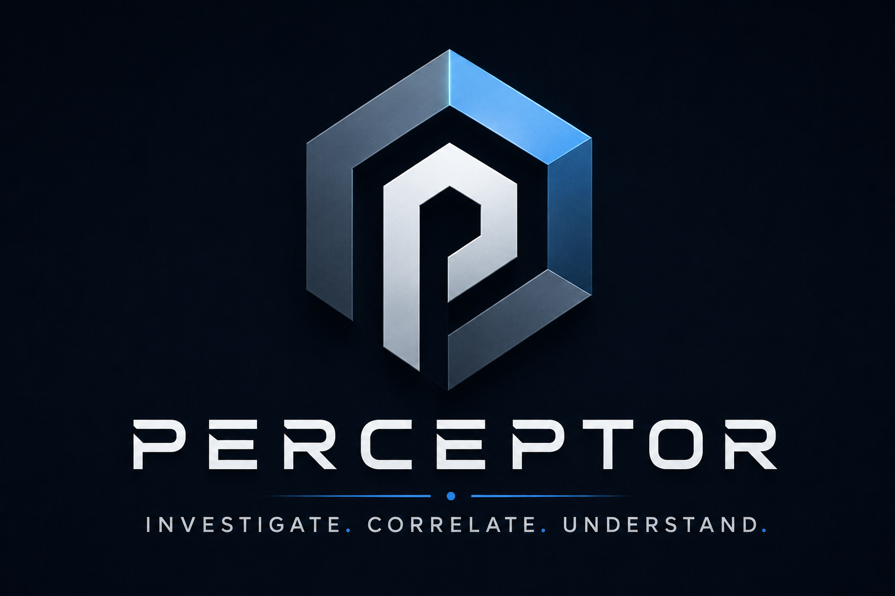

# Perceptor Documentation

Perceptor is a CLI-first forensic processing and reporting tool. It processes disk
images, imports live-response/report bundles, normalizes artifact output into a
case database, deduplicates derived artifacts, and generates investigator-facing
reports.

This documentation is organized for MkDocs. Each page covers one operator topic
so it can be hosted as a small internal manual.

## Start Here

- [Overview](getting-started/overview.md): core concepts and supported platform.
- [Ubuntu Install](getting-started/ubuntu-install.md): supported setup path.
- [First Run Checks](getting-started/first-run.md): doctor, smoke, and dependency
  verification.
- [Disk Images](workflows/disk-images.md): full image processing workflow.
- [Live-Case and Report ZIPs](workflows/live-case-zips.md): bulk import workflow.
- [Supported Artifacts](reference/supported-artifacts.md): artifact families,
  sources, and current coverage boundaries.
- [Field Readiness](operations/field-readiness.md): evidence integrity,
  preflight checks, limits, resumability, and field caveats.
- [MCP Overview](mcp/overview.md): connecting Perceptor to MCP-capable clients.

## Current Support Boundary

The supported platform is Ubuntu 24.04 LTS x86_64, either bare metal or a VM.
Native macOS and Windows are not supported for full processing. Docker is not the
primary target because mounting, FUSE, loop devices, and BitLocker workflows add
complexity.

Parsing-only workflows may run in more places, but full disk-image processing
should be treated as Ubuntu-only until explicitly validated elsewhere.
